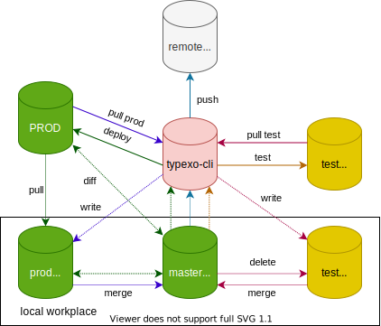

- [介绍](#介绍)
- [环境](#环境)
- [术语](#术语)
- [原理以及流程](#原理以及流程)
- [关于本地测试服务器](#关于本地测试服务器)
- [命令说明](#命令说明)
	- [🚧 `init`](#-init)
	- [✅ `rm`](#-rm)
	- [✅ `commit`](#-commit)
	- [✅ `discard-change`](#-discard-change)
	- [✅ `status`](#-status)
	- [✅ `merge {prod|test}`](#-merge-prodtest)
	- [✅ `fix-git-utf8`](#-fix-git-utf8)
	- [✅ `prod-test`](#-prod-test)
	- [❌ `clone <repo>`](#-clone-repo)
	- [✅ `pull {prod|test}`](#-pull-prodtest)
	- [🚧 `diff {prod|test}`](#-diff-prodtest)
	- [🚧 `deploy`](#-deploy)
	- [❌ `test`](#-test)
- [配置文件](#配置文件)
	- [`prod`字段](#prod字段)
	- [`test`字段](#test字段)
	- [`fields`字段](#fields字段)
	- [`defaultFields`字段](#defaultfields字段)
- [使用注意事项](#使用注意事项)

# 介绍

受到`Hexo`这样的基于`nodejs`的，可以本地编辑的博客的启发，`typexo`旨在对于`typecho`的博客开发类似的功能。本项目`typexo-cli`是本地端的实现，用于编辑内容、本地测试、远程部署。

目前本项目仅针对`MySQL`数据库进行开发，其他数据库日后会进行支持。

**请注意：服务端程序会直接对数据库进行操作，如果你不知道程序在干什么，请勿执行。硬盘有价，数据无价。请确保在操作之前对数据库进行备份。**

# 环境

- Python 3.7+
- Linux (WSL)
- Git
- MySQL (可选，用于本地测试服务器)
- PHP (可选，用于本地测试服务器)

# 术语

- `prod` - 生产环境
- `test` - 测试环境，即本地测试服务器
- `workplace` ( `wp` ) - 工作区

# 原理以及流程

<div align="center">
	
</div>

主要原理如上图。同一种颜色代表同一个流程；实线代表命令，虚线代表内部流程。

本地使用`git`进行管理分支，总共有三个分支: 

- `master`: 主分支，用于编辑；
- `prod`: 生产环境拉去下来的分支，用于`merge conflict`。注意：这个分支不得有任何改动，只能执行`typexo`的`pull prod`命令，自动完成。若出现错误，请执行`discard-change`命令；
- `test`: 本地测试分支 (可选)。本地经过测试后，若想同步测试服务器上的结果，可以通过`pull test`命令`merge`到主分支，随后测试分支将被删除，是一个临时分支。

注意：

- 在本项目中，所有的`checkout` (切换分支) 操作的先决条件是 `working tree clean` ，如果还有更改没有提交，将会拒绝分支切换请求；
- `test`分支在进行任意的合并操作之后会被自动删除，`prod`分支不会。如果没有合理的原因，请不要删除`prod`分支，否则会引发数据混乱；
- 在进行`deploy`的时候，我们并没有采用`git`的两个分支之间的`diff`，而是直接再度拉取服务器端的数据，直接进行比对。这样做的原因其实只是`GitPython`这块文档写得太含糊了...

# 关于本地测试服务器

我们的目标之一是能够像`Hexo`一样能够在本地搭建测试服务器，所以我们同时把`typexo-server`作为`submodule`引入了本项目。(这个功能相对独立，和其他部分无关)

实现方法：在本地搭建`php`服务器和`typexo-server`.

具体实现细节仍在考虑当中。

# 命令说明

注：✅代表已完成，❌代表未完成，🚧代表正在编写。

## 🚧 `init`

初始化`workplace`。会在当前目录新建一个`workplace`文件夹，然后在其内部初始化`git`。

## ✅ `rm`

删除`workplace`。直接删除`workplace`文件夹，需要操作确认。

## ✅ `commit`

相当于对当前分支进行`git commit -am`，提交代码。

## ✅ `discard-change`

相当于对当前分支进行`git reset --hard HEAD`，会删除所有未提交更改，需要操作确认。

## ✅ `status`

相当于对当前分支进行`git status`，获取当前信息。

## ✅ `merge {prod|test}`

先切换到主分支，然后合并输入的分支 ( `prod` / `test` )

## ✅ `fix-git-utf8`

修复`git`在命令行中可能对中文产生的乱码现象。等价命令：

```bash
git config --global core.quotepath false				# 显示 status 编码
git config --global gui.encoding utf-8					# 图形界面编码
git config --global i18n.commit.encoding utf-8			# 提交信息编码
git config --global i18n.logoutputencoding utf-8		# 输出 log 编码
```

Reference: http://howiefh.github.io/2014/10/11/git-encoding/

## ✅ `prod-test`

对生产环境进行连通性测试。

## ❌ `clone <repo>`

从远程仓库拉取`workplace`

## ✅ `pull {prod|test}`

从 `prod` / `test` 环境导入到本地对应分支，并自动进行`merge`操作。

## 🚧 `diff {prod|test}`

与远程`typexo-server`服务器传回的内容进行比对，列出更改 / 删除 / 增加过的项目。

## 🚧 `deploy`

部署到`prod`环境。

## ❌ `test`

本地搭建`test`环境，导入`sql`表，搭建`typecho`的`php-server`

# 配置文件

## `prod`字段

- `token` - 生产环境的`typexo-server`的验证`token`
- `url` - 生产环境`typexo-server`的访问链接

## `test`字段

- `token` - 测试环境的`typexo-server`的验证`token`
- `url` - 测试环境`typexo-server`的访问链接

## `fields`字段

在看这一节之前，请先了解`typecho_fields`数据库，是存储文章自定义字段的数据库。参考资料：

- [typexo-server API](https://github.com/JeffersonQin/typexo-server/blob/master/API.md)
- [typecho 数据库设计](https://docs.typecho.org/database)

由于官方对于自定义字段指定了三种`type`: 

- `str`
- `int`
- `float`

所以一些常用类型，比如说`boolean`会产生错误。为此，专门设置这个字段来指明各个自定义字段的属性。配置示例：

```yaml
fields:
  customField1: str
  customField2: int
  customField3: float
```

## `defaultFields`字段

`defaultFields`字段的作用就是配置在新建文章的时候，需要默认生成的自定义字段。配置格式：

```yaml
defaultFields:
  fieldName: fieldValue
```

注意：对于`yes`, `no`, `true`, `false`等本身带有特殊含义可以被解析的值而言，请加上引号。

# 使用注意事项

* **请勿直接在`metas.json`内添加新的`meta`，如果需要添加并更改属性，请使用其他方式，如：直接在浏览器中进行此操作 / 将新`meta`添加到一篇文章中，在`deploy`后再在`metas.json`中进行进行编辑**

